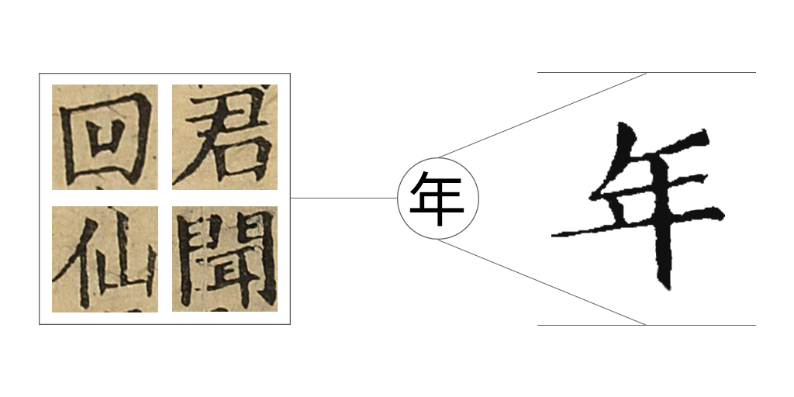

### Graphic Font

# 图形字体生成工具

基于模型训练，快速生成与案例风格相符的图形字体。使用 Transformer 框架来实现文字风格迁移。



## 项目结构

```bash
Project/
├── data/
│   ├── images/
│   │   ├── 1.png
│   │   ├── 2.png
│   │   ├── ...
│   ├── data.csv
├── model/
│   │   ├── calligraphy_model.pth
├── main.py
├── train.py
├── generate.py
```

## 服务部署

### 本地部署

* 依赖安装

  ```python
  pip install requirements.txt
  ```
* 确保项目文件结构完整，包含main.py、train.py、generate.py以及data和models文件夹，并且data文件夹内有正确的数据集和labels.csv文件。
* 可以直接运行main.py来启动整个流程，包括训练模型和生成图片：

  ```bash
  python main.py
  ```
* 如果只需要重新训练模型，可以单独运行train.py：

  ```bash
  python train.py
  ```
* 如果只需要生成图片，可以运行generate.py，并传入图片路径和文字参数：

  ```bash
  python generate.py path/to/new/image.jpg "示例文字"
  ```

### 部署为 Web 服务（可选）

* 安装 Flask

  ```bash
  pip install flask
  ```
* 运行 Flask 应用

  ```bash
  python app.py
  ```
* 通过浏览器或其他 HTTP 客户端访问http://server_ip:5000/generate，上传图片并输入文字来生成新的图片。
